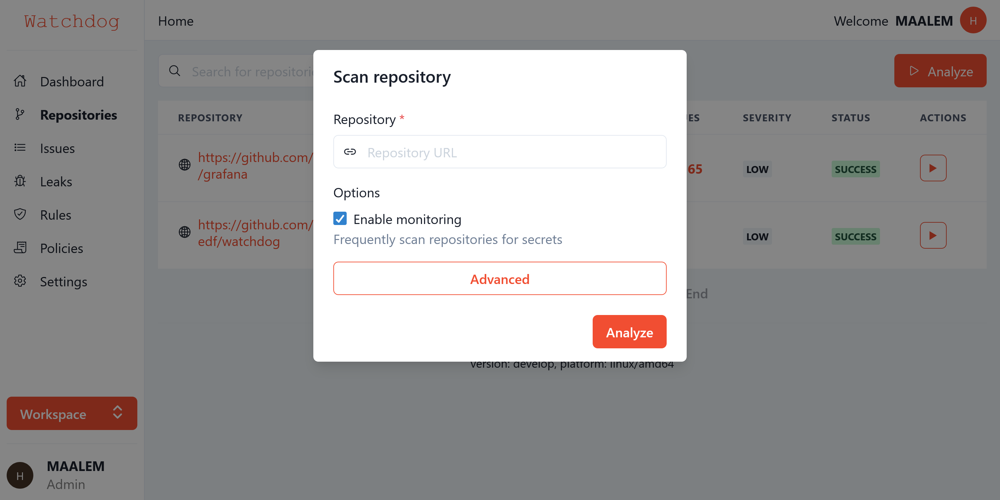

# Watchdog - Git server-side custom hooks
[](https://github.com/groupe-edf/watchdog/actions)
[](https://github.com/groupe-edf/watchdog)
[](https://goreportcard.com/report/github.com/groupe-edf/watchdog)
[](https://bestpractices.coreinfrastructure.org/projects/4370)

Watchdog allows to define custom hooks in YAML format. When attached to the official repository, some of these can serve as a way to enforce policy by rejecting certain commits or branches.



* [Features](#features)
* [Installation](#installation)
* [Usage](#usage)
* [Roadmap](#roadmap)
* [Contributing](#contributing)
* [License](#license)

## Example
```yaml
version: "1.0.0"
hooks:
  - name: global
    rules:
      - type: branch
        conditions:
        - type: pattern
          condition: ^(develop|master|revert-[a-z0-9-]+)|(feature|release|hotfix)/[a-z0-9-]+
      - type: commit
        conditions:
        - type: email
          condition: (?m)^[a-zA-Z.\-]+@gmail.com$
        - type: length
          condition: lt 120
          rejection_message: Commit message longer than {{ .Operand }}
      - type: file
        conditions:
        - type: size
          condition: lt 1mb
        - type: extension
          condition: exe
      - type: security
        conditions:
        - type: secret
          skip: docs/.*|.*.json|tests/.*
      - type: tag
        conditions:
        - type: semver
```

## Features

- Accept or reject commits message
- Check files size and extension
- Scan for secrets
- Check branch and tags names
- JSON reporting
- Public git repository scans

## Installation
Please refer to [Documentation](https://groupe-edf.github.io/watchdog/docs/deployment/install)

### From source
```bash
$ go get -ldflags="-X github.com/groupe-edf/watchdog/internal/version.Version=$(cat VERSION)" github.com/groupe-edf/watchdog
```
Or
```bash
$ git clone https://github.com/groupe-edf/watchdog && cd watchdog
$ go install -ldflags="-X github.com/groupe-edf/watchdog/internal/version.Version=$(cat VERSION)"
```

## Usage
First of all, you must create a `.githooks.yml` with some rules. See [Configuration](https://groupe-edf.github.io/watchdog/docs/quickstart/usage)

```bash
Usage:
  watchdog [command]

Available Commands:
  analyze     Run analysis
  help        Help about any command
  version     Print the version number of watchdog

Flags:
      --auth-basic-token string       authentication token used to fetch remote repositories
      --concurrent int                concurrent worker used to run analysus
  -c, --config string                 path to watchdog configuration file
      --docs-link string              link to documentation
  -h, --help                          help for watchdog
  -f, --hook-file string              path to external .githooks.yml file
      --hook-input string             standard input <old-value> SP <new-value> SP <ref-name> LF
      --hook-type string              git server-side hook pre-receive, update or post-receive
      --logs-format string            logging level (default "json")
      --logs-level string             logging level (default "info")
      --logs-path string              path to logs (default "/var/log/watchdog/watchdog.log")
      --output string                 path to output file
      --output-format string          report format (default "text")
      --plugins-directory string      path to plugins directory (default "plugins")
      --profile                       collect the profile to hercules.pprof.
      --security.reveal-secrets int   full or partial reveal of secrets in report and logs
      --uri string                    path to working directory
      --verbose                       make the operation more talkative (default true)
```

### Local git repository
```bash
$ watchdog analyze \
  --hook-file=".githooks.yml"
```

### Remote git repository
```bash
$ watchdog analyze \
  --hook-file=".githooks.yml" \
  --uri="https://github.com/{group}/{repository}"
```

## Roadmap
Watchdog roadmap uses [Github milestones](https://github.com/groupe-edf/watchdog/milestones) to track the progress of the project.

## Contributing
We would love you to contribute to `groupe-edf/watchdog`, pull requests are welcome! Please see the [CONTRIBUTING.md](CONTRIBUTING.md) for more information.

## License
The scripts and documentation in this project are released under the [GPL License](LICENSE)